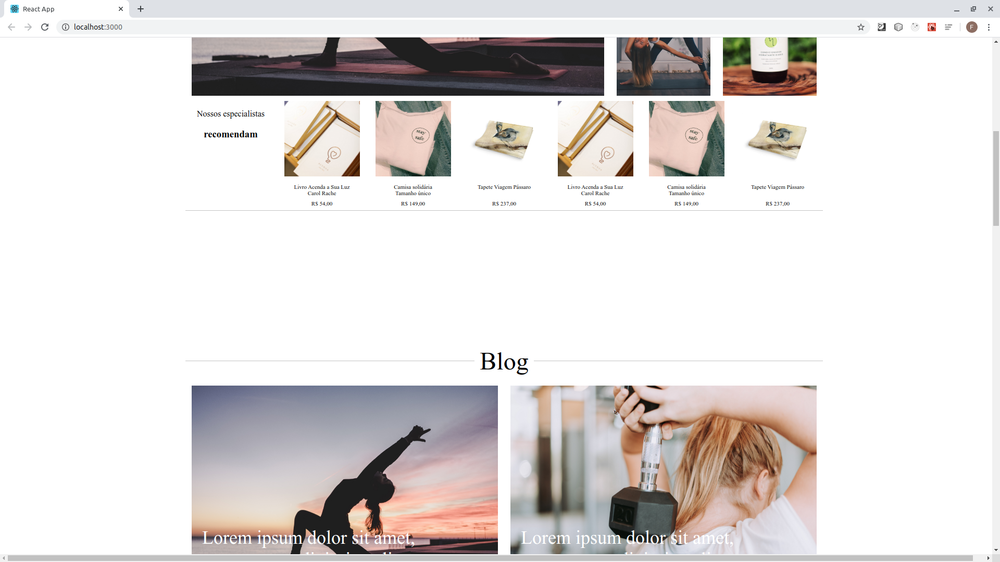
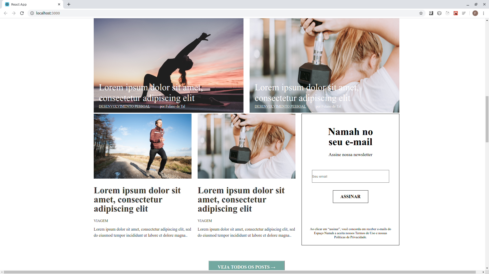
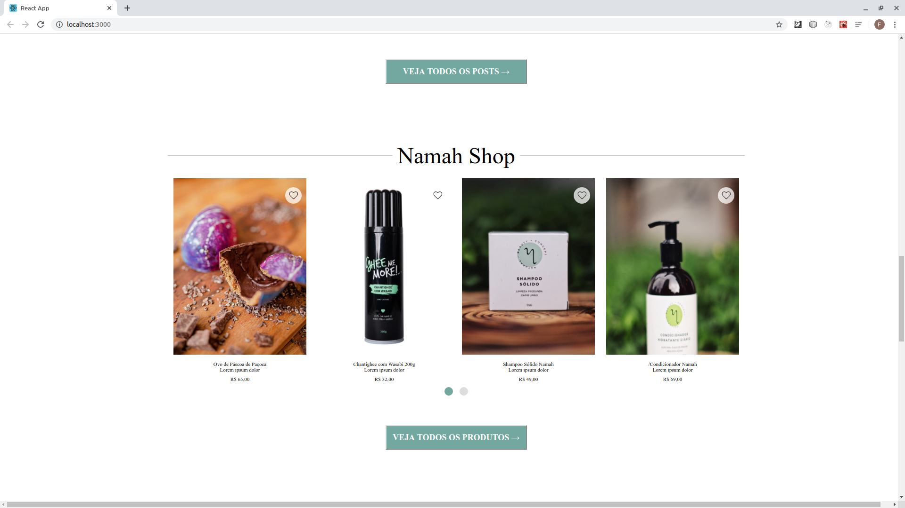
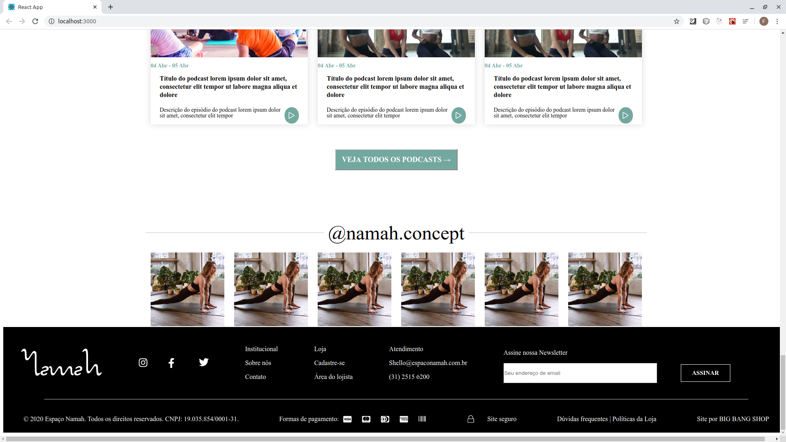
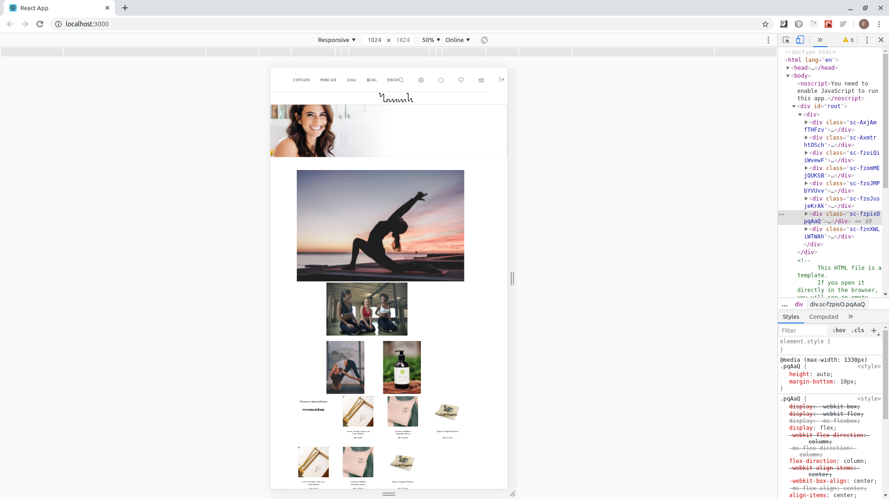
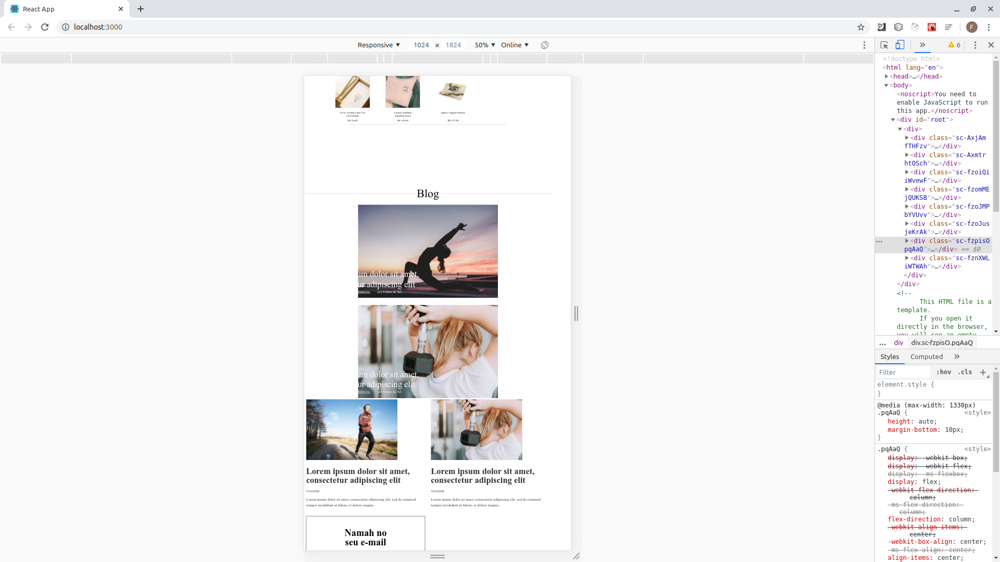
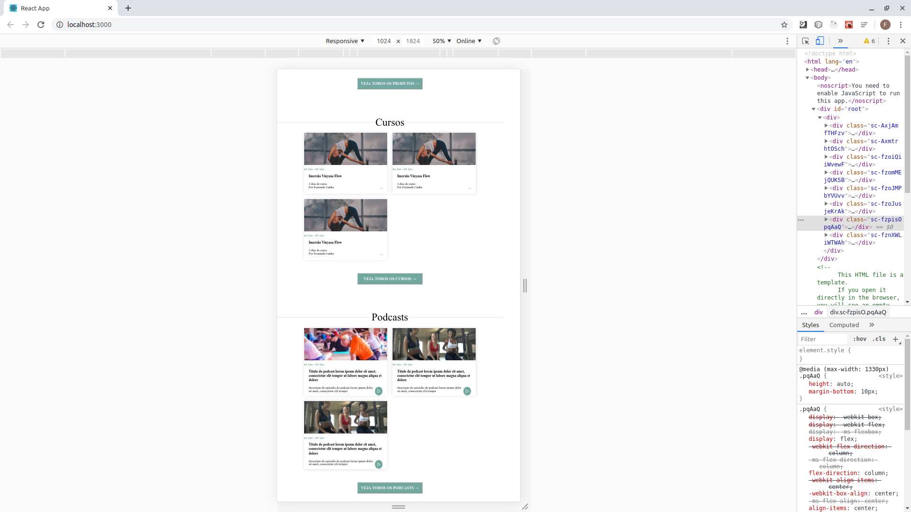
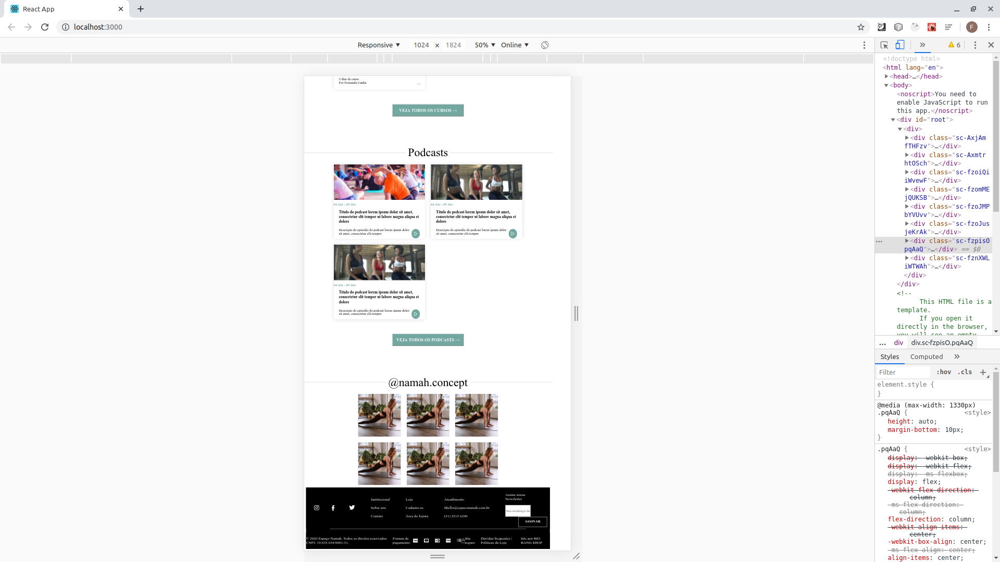

# desafio-frond-end-Big-Bang

Projeto do desafio front-end

### Principais tecnologias utilizadas
1. React
2. Styled-components
3. Css

### Escopo

O projeto consiste em implementação de uma interface a partir do mockuos fonrnecido.

### Critérios de avaliação
1. Responsividade do Layout
2. Reutilização dos componentes
3. Cobertura de testes
4. Organização do código

### Abaixo telas do chrome com a largura da tela em 1920px

### Abaixo telas do chrome com a largura da tela em 1024px, parcialmente responsiva

